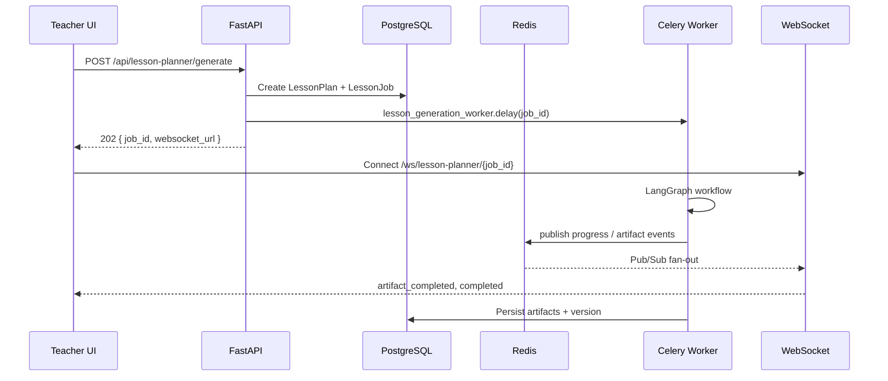

# AI Lesson Planner — Architecture (Phase 1)

## Overview

Production-grade lesson planner for teachers. Generation never blocks HTTP — all AI work runs in Celery workers. Real-time progress streams over WebSocket via Redis Pub/Sub.

## Directory layout

```
app/modules/teacher/lesson_planner/     # HTTP API, ORM models, domain service
app/services/lesson_planner/    # LangGraph workflow, agents, retrieval, workers
app/core/celery_app.py          # Shared Celery application
```

## Request flow



## LangGraph workflow

```
START → retrieve_context → retrieve_figures → retrieve_experiments
      → parallel_generation → validation → persist → END
```

## Database tables

| Table | Purpose |
|-------|---------|
| `lesson_plans` | Teacher lesson plan metadata |
| `lesson_plan_artifacts` | Generated JSON per artifact type |
| `lesson_plan_jobs` | Async job tracking |
| `lesson_plan_versions` | Version snapshots |
| `lesson_plan_exports` | PDF/DOCX/PPTX exports |

## Celery queues

| Queue | Worker task |
|-------|-------------|
| `lesson-generate` | `lesson_planner.generate` |
| `lesson-regenerate` | `lesson_planner.regenerate` |
| `lesson-export` | `lesson_planner.export` |
| `lesson-autosave` | `lesson_planner.autosave` |

## Environment variables

| Variable | Default | Description |
|----------|---------|-------------|
| `REDIS_URL` | `redis://localhost:6379/0` | Celery broker + Pub/Sub |
| `DATABASE_URL` | local Postgres | SQLAlchemy |
| `MISTRAL_API_KEY` | — | LLM generation |
| `LESSON_PLANNER_EXPORT_DIR` | `exports/lesson_planner` | Export output path |
| `LESSON_PLANNER_MAX_RETRIES` | `3` | Celery retries |
| `LESSON_PLANNER_OTEL_ENABLED` | `false` | OpenTelemetry export |
| `OTEL_EXPORTER_OTLP_ENDPOINT` | `http://localhost:4317` | OTLP collector |
| `LESSON_PLANNER_USE_PYDANTIC_AI` | `true` | Structured PydanticAI agents |

## Local setup

```bash
cd ai-tutor-backend
pip install -r requirements.txt          # step 1 — core stack
pip install -r requirements-lesson-planner.txt   # step 2 — do NOT combine with step 1
# Or: ./scripts/install-deps.sh
# Optional structured LLM agents:
# pip install -r requirements-lesson-planner-optional.txt
alembic upgrade head
uvicorn app.main:app --reload
celery -A app.core.celery_app.celery_app worker -Q lesson-generate,lesson-export,lesson-autosave,lesson-regenerate -l info
# macOS: defaults to solo pool (no fork) — override with CELERY_WORKER_POOL=prefork if needed
```

Or with Docker Compose (includes `lesson_worker` service):

```bash
docker compose up --build
```

## API endpoints

| Method | Path | Description |
|--------|------|-------------|
| POST | `/api/lesson-planner/generate` | Start generation (202) |
| GET | `/api/lesson-planner/jobs/{id}` | Job status |
| GET | `/api/lesson-planner/{id}` | Full plan + artifacts |
| GET | `/api/lesson-planner` | List plans |
| PATCH | `/api/lesson-planner/{id}` | Update metadata |
| DELETE | `/api/lesson-planner/{id}` | Soft delete |
| POST | `/api/lesson-planner/save` | Manual save + version |
| POST | `/api/lesson-planner/export` | Export PDF/DOCX/PPTX |
| POST | `/api/lesson-planner/cancel` | Cancel job |
| POST | `/api/lesson-planner/regenerate` | Regenerate artifacts |

WebSocket: `/ws/lesson-planner/{job_id}?access_token=<JWT>`

## Phased roadmap

### Phase 1 (this delivery)
- DB models + migration
- REST APIs + WebSocket
- Celery workers + Redis job state
- LangGraph orchestration with parallel artifact generation
- Hybrid RAG (dense + BM25 + RRF)
- Export stubs (PDF/DOCX/PPTX)
- Rate limiting, input sanitization, RBAC
- Unit tests

### Phase 2 (delivered)
- Wired `image_service` figure retrieval (`retrieval/figures.py`)
- Wired `science_experiment` catalog (`retrieval/experiments.py`)
- Chroma hybrid search + question bank (`retrieval/chroma_store.py`)
- PydanticAI structured agents with httpx fallback (`pydantic_ai_agent.py`)
- Pedagogy algorithms: Bloom, concepts, difficulty, prerequisite DAG, curriculum, misconceptions, worksheet balance
- OpenTelemetry tracing (`observability/tracing.py`) — enable via `LESSON_PLANNER_OTEL_ENABLED=true`
- Prometheus `/metrics/lesson-planner` + `/health/lesson-planner`
- Phase 2 unit + API tests

### Phase 3 (delivered)
- Frontend wired to real API + WebSocket (`src/api/lesson-planner.ts`, hooks, mappers)
- Job checkpoint/resume via Redis (`POST /api/lesson-planner/resume`)
- Chroma collection indexer (`indexing/chroma_indexer.py`)
- Rich export templates + download endpoint
- Factory Boy factories + GitHub Actions CI

### Future enhancements
